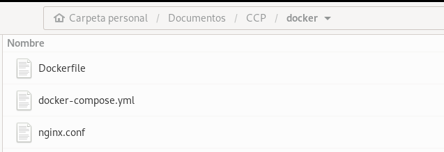

# Módulo Personalizado de Magento 2: Ccp_Module

## Descripción

Este módulo personalizado de Magento 2 proporciona funcionalidad CRUD para una entidad personalizada llamada `Ccp_Product`. Incluye un grid en el backend para listar todos los `Ccp_Product` y un formulario de edición para agregar y editar.

## Requisitos del Sistema

- PHP 8.2 o superior
- mariaDB 10. 
- Magento 2.4 o superior
- Composer 2.7
- Elasticsearch 8.11
- MariaDB 10.6 o MySQL 8.0
- apache 2.4 o nginx 1.24

## Instalación

1. Clona el repositorio en la carpeta `app/code/Ccp/Module` de tu instalación de Magento 2:

    ```bash
    git clone git@github.com:Ferchop89/magento-ccp.git app/code/Ccp/Module
    ```

2. Ejecuta los siguientes comandos para instalar el módulo:

    ```bash
    bin/magento setup:upgrade
    bin/magento setup:di:compile
    bin/magento setup:static-content:deploy -f
    bin/magento cache:clean
    bin/magento cache:flush
    ```

## Funcionalidad

- **CRUD de Cpp_Product:** Proporciona operaciones básicas de CRUD para la entidad `Ccp_Product` con campos como `product_id`, `name`, `sku`, `price`, y `description`.
- **Grid y Formulario de Edición en Backend:** Incluye un grid en el backend para listar todos los `Ccp_Product` y un formulario de edición para agregar y editar `Ccp_Product`.
- **Integración con API Externa:** Sincroniza los datos de `Ccp_Product` con una API externa.
- **Cron Job:** Un cron job que se ejecuta cada hora para actualizar la información de `Ccp_Product` desde la API externa.

## En respuesta a la parte 1 de la evaluación

### Configuración del Entorno de Desarrollo Local

Para configurar mi ambiente local de desarrollo con la última versión de Adobe Commerce, lo primero que se debe hacer es identificar la última versión estable en la [documentación oficial de Adobe](https://experienceleague.adobe.com/es/docs/commerce-operations/release/versions).

En esta liga, se puede apreciar que la última versión es la 2.4.7-p1 lanzada el 11 de junio de 2024.

Con este dato, podemos conocer los requisitos del sistema en la siguiente [liga](https://experienceleague.adobe.com/es/docs/commerce-operations/installation-guide/system-requirements).

Con esta información procedo a realizar la instalación básica de las tecnologías: Composer 2.7 (para instalar dependencias), Elasticsearch 8.11 (motor de búsqueda), MariaDB 10.6 o MySQL 8.0 (base de datos, en mi caso elijo MariaDB), PHP 8.2 o 8.3 (uso PHP 8.2), Apache 2.4 o Nginx 1.24 (servidor web).

También es necesario instalar las siguientes extensiones de PHP:

`ext-bcmath, ext-ctype, ext-curl, ext-dom, ext-fileinfo, ext-filter, ext-gd, ext-hash, ext-iconv, ext-intl, ext-json, ext-libxml, ext-mbstring, ext-openssl, ext-pcre, ext-pdo_mysql, ext-simplexml, ext-soap, ext-sockets, ext-sodium, ext-spl, ext-tokenizer, ext-xmlwriter, ext-xsl, ext-zip, ext-zlib, lib-libxml`

En cuanto a los requerimientos de hardware, la documentación oficial menciona que al menos se debe contar con 2 GB en RAM, un procesador de 64 bits con 2 núcleos y 10 GB de espacio libre en disco duro.

Con todas estas características, determiné que utilizaré Docker para tener una mayor flexibilidad y no depender del sistema operativo instalado en mi equipo.

Para usar Docker, es necesario instalar Docker y Docker Compose en el sistema operativo en el que se esté trabajando.

Generé un archivo llamado `docker-compose.yml` con las características mencionadas anteriormente.

Es necesario generar un archivo `nginx.conf`. 



Este archivo contiene la configuración principal para el servidor Nginx: nombre del servidor, puerto por donde escucha, directorio principal, procesamiento de PHP, configuración de cache, etc.

Este archivo se coloca dentro del directorio en donde se instalará el proyecto. Para iniciar o levantar los contenedores se ejecuta el comando:

```bash
docker-compose up -d
```
Cuando se levantan los contenedores, es necesario revisar los errores que se presentan. La mayor parte de estos errores se deben a que los puertos ya están utilizados por alguna aplicación instalada.

Una vez que se tiene levantada toda esta infraestructura, se generan directorios de todos los contenedores levantados. Es necesario cambiar el propietario de estos directorios para evitar problemas de permisos.

```bash
sudo chown -R $USER:$USER web/ elasticsearch/ mysql/ nginx/
```

La instalación de Adobe Commerce o Magento se puede realizar vía Composer o mediante Git. En mi caso lo realicé mediante Composer.

Ingreso al directorio del contenedor web y ejecuto el comando:

```bash
docker exec -u root -it magento-web bash
```
Cambio de grupo y contraseña al usuario Magento:

```bash
passwd magento
usermod -a -G www-data magento
```

Mediante Composer, realizo la instalación:
```bash
composer create-project --repository-url=https://repo.magento.com/ magento/project-community-edition magento
```
Al realizar esto, solicita un usuario (public key) y contraseña (private key). Los cuales deben obtenerse del Marketplace de Adobe Commerce en la sección Access Keys.

Una vez que termina este proceso, se agrega el archivo env.php en el directorio app/etc/env.php. Aquí se configuran las conexiones de bases de datos, Elasticsearch, etc.

Procedo con la instalación de Adobe Commerce con el comando:

```bash
bin/magento setup:install \
--base-url=http://pruebas.local \
--db-host=mariadb \
--db-name=magento \
--db-user=magento \
--db-password=magento \
--admin-firstname=Admin \
--admin-lastname=User \
--admin-email=admin@example.com \
--admin-user=admin \
--admin-password=Mexico01 \
--elasticsearch-host=elasticsearch \
--elasticsearch-port=9200 \
--elasticsearch-enable-auth=1 \
--elasticsearch-username=elastic \
--elasticsearch-password=Mexico01 \
--language=en_US \
--currency=USD \
--timezone=America/Mexico_City \
--cleanup-database \
--use-rewrites=1
```

Ahora se ejecuta el comando:

```bash
bin/magento setup:upgrade && bin/magento setup:di:compile && bin/magento setup:static-content:deploy -f && bin/magento c:f
```

Con esto, ya se puede ingresar desde la URL configurada. En mi caso, http://pruebas.local.

### Herramientas y extensiones en el entorno de desarrollo
PHPStorm: IDE principal para desarrollo.
Xdebug: Para depuración.
Magento 2 Coding Standard: Para verificar el código.

```bash
composer require magento/magento-coding-standard
```

En algunos casos, puede ser necesario desactivar ciertos módulos en Magento 2 para mejorar el rendimiento, solucionar conflictos o adaptar la funcionalidad a necesidades específicas. A continuación, se describe cómo desactivar los módulos `Magento_AdminAdobeImsTwoFactorAuth` y `Magento_TwoFactorAuth`.

Para desactivar los módulos, ejecuta los siguientes comandos en la línea de comandos dentro del directorio raíz de tu instalación de Magento 2:

```bash
bin/magento module:disable Magento_AdminAdobeImsTwoFactorAuth
bin/magento module:disable Magento_TwoFactorAuth
```
Después de desactivar los módulos, es recomendable hacer un upgrade y limpiar la caché de Magento para asegurar que los cambios surtan efecto correctamente:

```bash
bin/magento setup:upgrade bin/magento cache:flush
```
